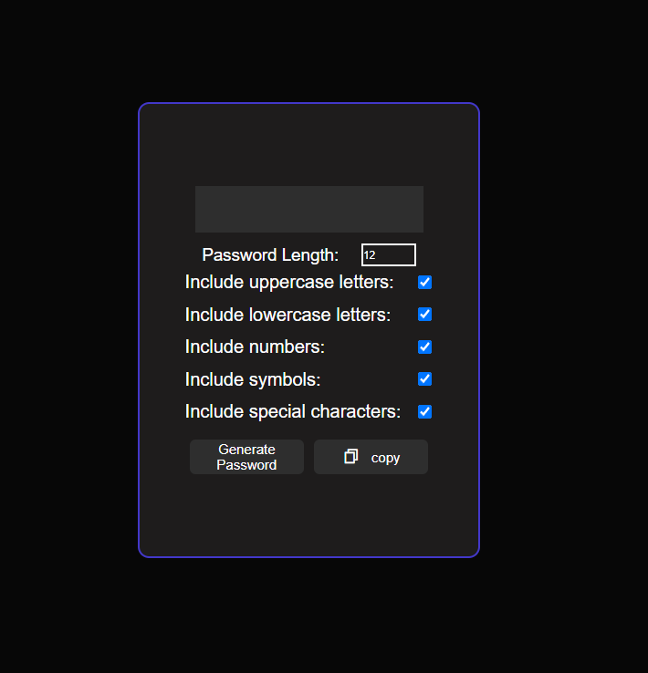

# Password Generator

A simple, customizable password generator built with HTML, CSS, and JavaScript. Users can specify password length and include/exclude character types like uppercase letters, lowercase letters, numbers, symbols, and special characters.

## Features

- Set password length (8–20 characters).
- Option to include or exclude:
  - Uppercase letters
  - Lowercase letters
  - Numbers
  - Symbols
  - Special characters
- Copy the generated password to the clipboard.

## Demo

 <!-- Add a screenshot if available -->

## Installation

1. Clone the repository:
   ```bash
   git clone https://github.com/methreamarnath1/PasswordGenrater.git
   Navigate to the project directory:
   ```

bash
Copy code
cd password-generator
Open index.html in your browser.

Usage
Open the Password Generator page.
Use the "Password Length" input to select your desired password length.
Check or uncheck the options to include uppercase letters, lowercase letters, numbers, symbols, and/or special characters.
Click the "Generate Password" button to create a random password.
Click the copy icon to copy the generated password to your clipboard.
Code Overview
HTML
The HTML structure includes:

An input box to display the generated password.
Checkbox options for different character types.
A number input for selecting password length.
Buttons for generating and copying the password.
CSS
The CSS defines a dark-themed layout for the password generator, centering all components and providing a simple, user-friendly UI.

JavaScript
The JavaScript handles:

Generating a random password based on selected options.
Copying the generated password to the clipboard using navigator.clipboard.writeText.
Dependencies
None. This project uses only vanilla HTML, CSS, and JavaScript.
License
This project is licensed under the MIT License. See the LICENSE file for more details.

markdown
Copy code

### Explanation

- **Features**: Lists the main functionality.
- **Demo**: Placeholder for a screenshot (optional but helpful).
- **Installation & Usage**: Provides instructions for setting up and using the app.
- **Code Overview**: Briefly explains the roles of HTML, CSS, and JavaScript in the project.
- **License**: Indicates the open-source license (replace or add details as needed).
